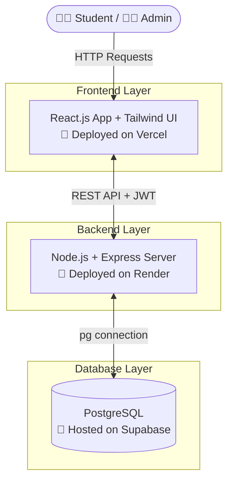

<div align="center">
  <h1>🎯 Quiz & Assessment Platform</h1>
  <p>A full-stack, "HackerRank-style" technical assessment platform designed for club coordinators to conduct timed quizzes and automatically evaluate student submissions.</p>

  
  
  
  
  
  
  
  
</div>

---

## 🚀 Live Demo & Deployment

The application is fully containerized and deployed across specialized cloud platforms for maximum efficiency:

- 🖥️ **Frontend (Deployed on Vercel):** [https://quiz-assessment-platform-three.vercel.app](https://quiz-assessment-platform-three.vercel.app)
- ⚙️ **Backend API (Deployed on Render):** [https://quiz-assessment-platform-6obd.onrender.com/api/health](https://quiz-assessment-platform-6obd.onrender.com/api/health)
- 🗄️ **Database (Hosted on Supabase):** PostgreSQL Transaction Pooler

---

## 🏗️ Architecture Diagram



---

## 📂 Project Structure

```text
quiz-assessment-platform/
├── frontend/                  # React Frontend (Vite)
│   ├── src/
│   │   ├── components/        # Reusable UI elements (Navbar, Buttons)
│   │   ├── context/           # React Context (AuthContext)
│   │   ├── pages/             # Route views (AdminDashboard, QuizTaking, etc.)
│   │   ├── App.jsx            # Main app router
│   │   └── main.jsx           # React entry point
│   ├── package.json
│   └── tailwind.config.js     # Styling configuration
│
├── backend/                   # Node.js/Express API
│   ├── src/
│   │   ├── config/            # DB connection (pg Pool) and Environment setup
│   │   ├── controllers/       # Route logic (authController, quizController)
│   │   ├── middleware/        # JWT Verification & Error Handling
│   │   ├── models/            # SQL query abstractions
│   │   ├── routes/            # Express route definitions
│   │   └── server.js          # API entry point
│   ├── tests/                 # Jest & Supertest API tests
│   └── package.json
│
└── README.md                  # Project Documentation
```

---

## 🎯 Core Features Achieved
✅ **Authentication:** Role-based JWT login for Students and Admins/Coordinators.
✅ **Quiz Management:** Admins can create quizzes, set durations, and toggle negative marking.
✅ **Question Bank:** Add, edit, and delete multiple-choice questions dynamically.
✅ **Test Environment:** 
  - Strict global timers & local per-question timers.
  - Questions are securely randomized on load.
  - Auto-submits when the global timer expires.
✅ **Evaluation:** Secure, server-side automatic evaluation preventing client-side cheating.
✅ **Leaderboards:** Real-time ranking system for each assessment.
✅ **Admin Dashboard:** High-level overview of active assessments, total submissions, and average scores.

## ⭐ Optional Features Implemented
✅ **Difficulty Levels:** Tag questions as Easy, Medium, or Hard.
✅ **Categories:** Organize questions by topics (e.g., Core JS, React).
✅ **Negative Marking:** Optional strict mode that penalizes incorrect answers.
✅ **Certificate Generation:** Students receive an interactive, downloadable completion certificate.
✅ **Question Analytics:** Admins can see exactly how many students got a specific question right/wrong.

---

## 📂 Branching Strategy
This project utilized a strict Git branching strategy:
- `main`: Stable, production-ready code.
- `develop`: Integration branch for new features.
- `feature/*`: Dedicated branches for developing specific tasks like analytics and deployment configurations.

---

## 📡 API Documentation

### Authentication
- `POST /api/auth/register` - Register a new user (`name`, `email`, `password`, `role`).
- `POST /api/auth/login` - Authenticate and receive a JWT.

### Quizzes (Admins)
- `POST /api/quizzes` - Create a new quiz.
- `GET /api/quizzes/my-quizzes` - Fetch quizzes created by the logged-in admin.
- `POST /api/quizzes/:id/questions` - Add a question to a quiz.
- `PUT /api/quizzes/questions/:qId` - Edit a question.
- `DELETE /api/quizzes/questions/:qId` - Delete a question.
- `GET /api/quizzes/admin/analytics` - Get high-level admin dashboard stats.
- `GET /api/quizzes/:id/question-analytics` - Get success rates per question.

### Assessments (Students)
- `GET /api/quizzes` - Fetch all available published quizzes.
- `POST /api/attempts/start/:quizId` - Initialize a secure quiz session.
- `GET /api/quizzes/:id/questions` - Fetch questions for an active session (correct answers stripped).
- `POST /api/attempts/:id/submit` - Submit answers for server-side evaluation.
- `GET /api/attempts/:id/result` - View scorecard and generated certificate.
- `GET /api/quizzes/:id/leaderboard` - View top scores for a specific quiz.

---

## 🧪 Testing
Basic unit and integration tests are configured using **Jest** and **Supertest**.
To run the API health tests locally:
```bash
cd backend
npm test
```

---

## 💻 Local Setup Instructions

1. **Clone the repository**
   ```bash
   git clone https://github.com/PRANAYGOUR/quiz-assessment-platform.git
   ```

2. **Backend Setup**
   ```bash
   cd backend
   npm install
   # Create a .env file with DATABASE_URL and JWT_SECRET
   npm start
   ```

3. **Frontend Setup**
   ```bash
   cd frontend
   npm install
   # Create a .env file with VITE_API_URL=http://localhost:10000/api
   npm run dev
   ```
